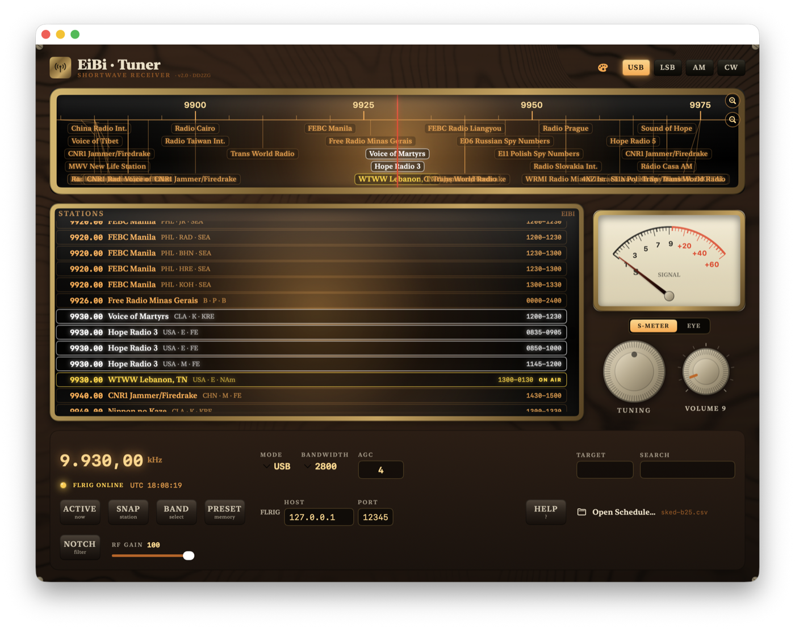
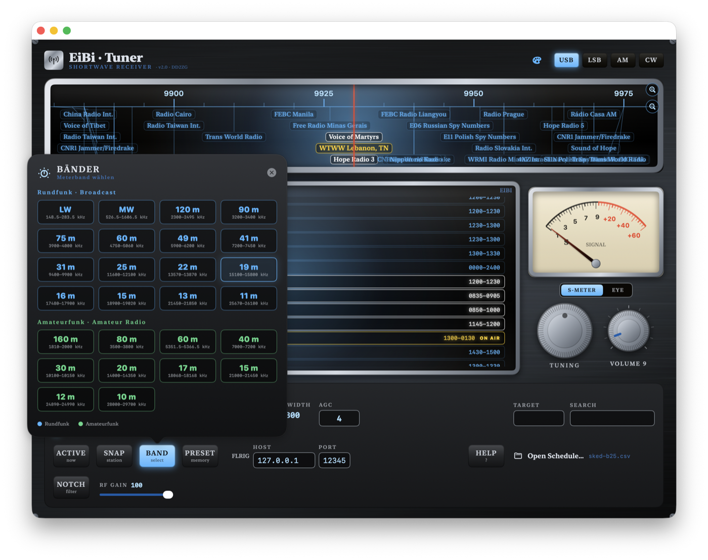

# EiBi-Tuner

A macOS shortwave receiver console styled like a vintage valve radio. EiBi-Tuner remote-controls a transceiver through [FLRIG](http://www.w1hkj.com/flrig-help/) and overlays broadcast schedules from the [EiBi](https://eibispace.de/) and ILG frequency databases directly on the dial, so you always see what's transmitting on the frequency you're tuned to.

Built with SwiftUI for macOS 14+.

<p>
  
  
</p>

## Features

- **Two-way FLRIG control** — drag the dial, use the tuning knob, scroll, or type a frequency; the rig follows in real time, and vice versa.
- **Live schedule overlay** — loads EiBi CSV or ILG schedule files and shows every station on the dial and in a full-spectrum, scrollable station list. Stations currently on the air are marked; a station that's both tuned and on the air is highlighted in yellow.
- **Manual dial zoom** — widen or narrow the visible frequency span to reduce clutter when many stations sit close together.
- **Band and preset memories** — jump straight to any shortwave broadcast or amateur band, or save your own 20 frequency presets.
- **Mode / bandwidth / AGC / squelch / RF gain / notch** — mirrors whatever your rig exposes through FLRIG.
- **S-meter or "magic eye" tuning indicator** — classic moving-coil meter or an animated EM34-style tuning tube.
- **Two cabinet styles** — a warm oak-and-brass "Wood" look with amber backlighting, or a black brushed-metal "Metal" look with silver trim and blue backlighting.
- **Keyboard tuning** — left/right arrows step 1 kHz, up/down jump to the next/previous station in the loaded schedule.
- Session state (frequency, mode, presets, FLRIG host/port, theme, filters) is remembered between launches.
- Bilingual (German/English) Help window that follows your system language.

## Requirements

- macOS 14 or later
- [FLRIG](http://www.w1hkj.com/flrig-help/) running and connected to your transceiver
- An EiBi (`.csv`) or ILG schedule file — freely available from [eibispace.de](https://eibispace.de/)

## Getting started

1. Start FLRIG and connect it to your rig.
2. Open `EiBi-Tuner.xcodeproj` in Xcode and run the app (or build from the command line, see below).
3. In the app, set the FLRIG **HOST**/**PORT** fields (default `127.0.0.1` : `12345`) — the "FLRIG ONLINE" lamp lights up once connected.
4. Open a schedule via **Open Schedule…** (or ⌘O).
5. Tune away — drag the dial, use the knob, scroll, or click a station.

## Tipps
Limit the number of displayed stations to those who are important you
1. If you live in the EU, enter 'eu' in the **TARGET** field to show only those stations that target your area
2. Push the **ACTIVE** button to only show those stations that are live at the moment
3. If you enter part of the station name in the **SEARCH** field, you only see these stations, like 'dwd' for German weather service.
4. Double click on a name in the list and your receiver is tuned to that station.

See the in-app Help window (the **HELP** button, or the Help menu) for the full control reference.

## Building from the command line

```sh
xcodebuild -project EiBi-Tuner.xcodeproj -scheme EiBi-Tuner -configuration Debug -destination 'platform=macOS' build
```

## Data sources

Broadcast schedules are provided by the [EiBi database](https://eibispace.de/) (eibspace) and compatible ILG listings — many thanks to their maintainers. EiBi-Tuner only reads these files locally; it does not bundle or redistribute the schedule data itself.

## Credits

Developed by Peter Betz, DD2ZG. Based on the original `eibi_tuner` project.

## License

MIT — see [LICENSE](LICENSE).
